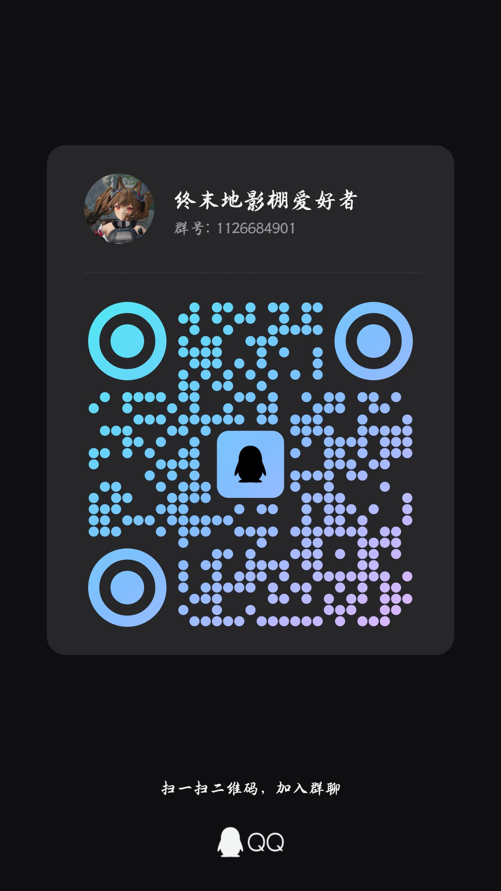

# Endfield Poser

《明日方舟：终末地》的游戏内摆姿插件：把角色冻结在当前姿态，用 3D 旋转盘和参数面板直接摆姿势，
保存 / 载入姿态预设，方便游戏内取景与后续参考。

> ⚠️ 非官方第三方工具，与游戏厂商无关。使用前请先读文末的[用户协议与免责声明](#用户协议与免责声明)。

- 下载：[Releases · latest](https://github.com/honxi1/Endfield-Poser/releases/latest)
  （项目自 2026-09 起在本仓库维护，版本号沿用；旧链接失效时以这里为准）
- **使用须知（先看这个）**：[docs/notice.md](docs/notice.md) —— 安装、首次弹窗、热键、文件位置、卸载
- 图文教程：[docs/tutorial.md](docs/tutorial.md)　功能与后续计划：[docs/roadmap.md](docs/roadmap.md)
- 许可：整体按 **AGPL-3.0** 发布（[LICENSE](LICENSE)）；第三方来源与依赖见
  [THIRD_PARTY_NOTICES](THIRD_PARTY_NOTICES)

## 快速开始

| 包内文件 | 放到 |
|---|---|
| `d3dcompiler_47.dll` | 游戏根目录（**先备份游戏自带的那份**） |
| `vulkan-1.dll` | 游戏根目录（**同样先备份**） |
| `plugin\poser.dll` | 游戏根目录的 `plugin\` |
| `plugin\poser_config.txt` | 游戏根目录的 `plugin\` |

> 📁 是 **`plugin\`（单数，插件目录）**，不是游戏自带的 `plugins\`（复数，Qt 插件目录）。
> 没有这个文件夹就自己新建一个。

> ℹ️ **两个代理一起放**（`安全安装.bat` 会自动备份并复制它们）：DX11 走 `d3dcompiler_47.dll`、
> Vulkan 走 `vulkan-1.dll`，同时放着互不影响。

1. 解压 → 双击包内 `安全安装.bat`（或按上面的表手动放置）；
2. 用**官方启动器**或 **XXMI** 启动游戏，游戏用「窗口化 / 无边框全屏」；
3. 第一次进游戏会弹【用户协议与免责声明】：读完 → 点「同意并继续」；
4. 按 `L` 呼出面板，`P` 冻结 / 解冻；面板点不到就按住 `Alt` 呼出游戏光标再点。

热键可在面板顶部「快捷键（可改）」里改（自动写回配置，`Esc` 取消）；
完整说明见[使用须知](docs/notice.md)，从安装到出片的流程见[图文教程](docs/tutorial.md)。

## 功能一览

- **角色冻结**：关闭角色动画并抑制其它写骨骼的系统，每帧维持当前姿态；从骨可跟随冻结或保持演算。
- **摆姿编辑**：3D 点选骨骼 + 旋转盘拖动；旋转 / 位置支持滑条、数值输入、± 步进与复位。
- **从骨控制**：头发、裙子、飘带等从骨可单独编辑，编辑结果会同步进冻结基线。
- **姿态预设**：命名保存 / 覆盖 / 载入 / 删除（含从骨数据）；保存位置可配置。
- **表情**：面部 BlendShape + 游戏原生 SMC 表情，以"中性默认脸"为基准；冻结时保持当前表情。
- **多角色**：冻结状态按角色记忆，切回冻过的角色会恢复离开时的姿势。
- **WebUI**：插件启动后监听 `http://127.0.0.1:18923`，可在浏览器里辅助操作。
- **实验性**：IK 控制器（默认关，面板里可勾；骨骼跟随尚未完成）。

各功能的细节与后续计划见 [docs/roadmap.md](docs/roadmap.md)。

## 配置（`plugin\poser_config.txt`）

```
gui_toggle_key=L          # 支持 L / CTRL+L / INSERT / 0x2D 这类写法
freeze_key=P              # 冻结 / 解冻（写法同上）
click_through=1           # 1=覆盖层常驻并真穿透（推荐）；0=按住 Alt 才显示面板
overlay_mode=0            # 0=自动（检测到 XXMI/3DMigoto 时改用分层窗口）；1=强制 DComp；2=强制分层窗口
overlay_fps=60            # 分层窗口路径的呈现帧率上限（0=不限；mod 多/机器吃紧可降到 30）
ik_enabled=0              # 实验性的 IK 控制器（0=关；面板里也可以勾）
default_pose_dir=plugin\poses
```

`default_pose_dir` 支持绝对路径，或相对游戏根目录的路径；面板底部会显示当前保存位置。

## 构建

### Windows（插件本体，MSVC）

```powershell
# 本机（VS 18 Insiders、无 cmake、无系统 Windows SDK）：
powershell -ExecutionPolicy Bypass -File tools\setup_winsdk.ps1   # 首次：拉取 Windows SDK 到 deps/（需联网）
powershell -ExecutionPolicy Bypass -File tools\build_msvc.ps1     # 编译 plugin/ 并跑三个数学单测

# 有 cmake + VS 工具链时：
build.bat
```

两种方式产物都落在 `plugin/`：`poser.dll`（插件）、`d3dcompiler_47.dll`、`vulkan-1.dll`（代理）。
发布包用 `tools\package_release.ps1 -Version x.y.z` 组装（会顺带做署名自查）。

### Linux / 沙箱（数学层单测）

```bash
cmake -S . -B build && cmake --build build && ctest --test-dir build
```

测试覆盖 `math/` 层（`test_quat` / `test_ik` / `test_pose_file`）；插件本体只能在 Windows + 游戏内验证。

## 目录结构

```
endfield-poser/
├── CMakeLists.txt        # Windows: 插件 DLL + 代理 DLL；tests: 数学单测
├── build.bat             # 有 cmake 时的一键构建（否则回退 build_msvc.ps1）
├── deps/                 # 自包含第三方：imgui / imguizmo / minhook_lib / json
├── packaging/            # 发布包里的安装说明与默认配置模板
├── tools/                # build_msvc.ps1、package_release.ps1、setup_winsdk.ps1 等
├── src/
│   ├── poser.cpp         # DLL 入口 + 插件宿主协议 + 每帧调度 + 主面板
│   ├── config.h          # poser_config.txt 读写、热键解析
│   ├── core/             # base / il2cpp_api / game_hooks / gui_overlay / web_server / 代理 DLL
│   ├── math/             # quat_math / ik_two_bone / pose_file（纯 C++，可单测）
│   ├── game/             # skeleton / accessory / freeze / cloth / morph / smc_morph
│   └── editor/           # selection / rig_gizmo / panel_*（含实验性 IK 控制器）
├── tests/                # math 层单测（g++ 亦可跑）
└── docs/                 # notice.md（使用须知）、tutorial.md（教程）、roadmap.md（功能与计划）
```

## 已知问题

- **表情不能跨角色通用**：面部由 SMC（骨骼变形）驱动，表情权重不写入姿态文件——保存的姿态只含骨骼与
  从骨，换角色要重新调表情；强行套用别的角色面部骨会得到错位 / 夸张的脸（面板默认勾选
  「不保存 / 不套用表情」，旧文件里带这类数据时载入也会跳过）。
- **表情滑条只覆盖游戏自带的那 5 个口型 + 19 个表情**：其它 morph 滑条表示不了，但会被内部基准保住
  （脸不会跳变、不会错位）。
- **装了较多第三方渲染 mod 的机器上面板会卡顿**：分层窗口路径每帧要做一次 GPU→CPU 回读；已做两项缓解
  （面板内容没变时跳过整轮回读、`overlay_fps` 限帧），吃紧就把 `overlay_fps` 降到 30。
- **冻结后骨架有轻微颤抖**（老机制遗留：逐帧钉姿势会和游戏侧仍在写的系统轻微打架）。不影响摆姿与保存。
- **IK 控制器是实验性功能、默认关闭**：面板里勾 `IK 控制器（实验性）`（或 `ik_enabled=1`）才出现。
  目前可以选中 / 拖动手柄，**骨骼跟随尚未完成**。
- 撤销 / 重做、骨骼层级树、骨骼镜像、外置姿态导出未包含在本版。

## 交流 / 反馈

非官方粉丝项目与交流群，与 Hypergryph 无关。

- QQ 群：**终末地影棚爱好者**（群号 1126684901）
- 邮箱：**king_time@foxmail.com**（版权 / 内容下架等问题优先发邮件）
- 扫码入群：



遇到问题欢迎带上 `plugin\poser_log.txt` 与复现步骤，在 issue 或群里反馈。

## 致谢

感谢以下贡献者：

- [White-NX](https://github.com/White-NX) —— XXMI / 3DMigoto 兼容的 layered-window overlay 实现；
- [Nordlicht S](https://github.com/NordlichtS) —— 安全安装 / 卸载脚本（备份、还原与路径校验）。

## 用户协议与免责声明

<details>
<summary>在下载、安装或使用本插件（Endfield Poser）之前，请先读完以下条款；<b>继续使用即表示你已阅读、理解并同意全部条款。</b></summary>

> 首次启动时，同一份条款会以弹窗形式出现：需要把内容读到末尾、点「同意并继续」之后，
> 插件才会安装游戏侧 hook 并开始工作；未同意前不加载任何游戏相关功能。
> 同意之后，面板顶部的「用户协议」按钮可以随时回看（只读窗口）。

### 1. 开源许可与最终用户权利

- 本仓库整体按 **AGPL-3.0** 发布（[LICENSE](LICENSE)）；`src/core/` 含上游开源项目的衍生内容，
  出处与第三方依赖见 [THIRD_PARTY_NOTICES](THIRD_PARTY_NOTICES)（含责任边界说明）。
- 在**不修改**本插件的前提下，最终用户使用、复制与分发不受额外限制；
  公开分发修改版需按 AGPL 提供完整源码，不可改为 MIT / 专有许可发布。

### 2. 反欺诈声明

- 本项目在 GitHub 上**免费开源**。如果你是通过付费渠道获取的，请知悉你可以在
  [本仓库](https://github.com/honxi1/Endfield-Poser)免费获取。
- 请勿在任何平台售卖本插件本体、却不提供仓库地址与售后支持。

### 3. 内容合规与行为约束

- 本项目是**非官方第三方工具**，与《明日方舟：终末地》的开发商 / 发行商（Hypergryph、鹰角网络）
  **没有任何隶属、合作或授权关系**，也未获得其认可。
- 本插件本身不包含任何游戏美术资产。游戏内置的官方动画、场景、模型等资产其版权完全隶属于
  鹰角网络，并不适用 AGPL-3.0 协议。
- 请**仅在单人 / 摄影模式**下使用；**不要在多人联机、竞技或任何会影响他人游戏体验的场景使用**。
- **不得**利用本插件或游戏内置的官方动画、场景、模型等资产，制作、播放或传播任何不合适的
  动作 / 动画（包括但不限于色情、暴力、政治敏感等违反法律法规或引起社区不适的内容）。
- 请勿使用本工具**修改或传播任何付费内容与游戏资源**（模型、贴图、音频等）；
  姿态文件只应包含你自己摆出的骨骼数据。

### 4. 风险与免责声明

- 本项目以**学习、技术研究与交流**为目的；作者不提供商业支持，也不对其商业使用负责
  （许可条款以 LICENSE 的 AGPL-3.0 为准，该许可本身不限制商业使用）。
- 本工具通过与游戏客户端同进程运行来提供面板与摆姿功能。这类使用方式**可能违反游戏服务条款**，
  存在**账号被限制或封禁**的风险；请自行评估风险并承担全部后果，**建议在测试账号上运行**。
- 作者不对使用本工具造成的任何损失负责（包括但不限于账号封禁、数据丢失、设备异常）。
- 如相关权利人、游戏官方或平台认为本仓库 / 发布包中的任何内容不妥，请通过
  **king_time@foxmail.com**（或 [issue](https://github.com/honxi1/Endfield-Poser/issues) /
  文末交流群）联系作者，**收到通知后会第一时间处理（包括删除相关内容、停止分发）**。
- **如果你不接受以上任何一条，请立即停止使用并删除本工具**：用包内 `安全安装.bat` 卸载，
  或手动删除 `plugin\poser.dll`、`plugin\poser_config.txt` 与游戏根目录的两个代理 DLL 并还原备份。

</details>
